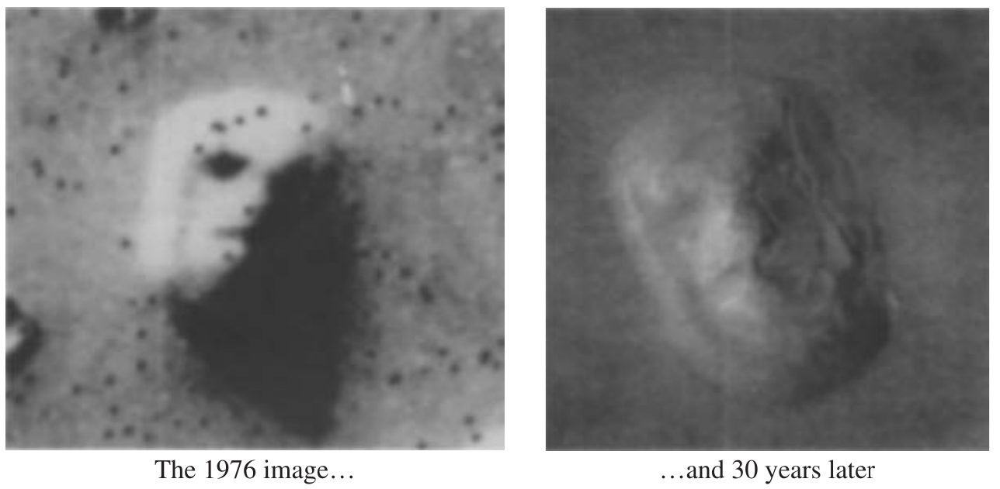

```{r setup, include=FALSE}
knitr::opts_chunk$set(warning = FALSE, message = FALSE, 
                      fig.retina = 3, fig.align = "center")
```

```{r xaringanExtra, echo=FALSE}
xaringanExtra::use_xaringan_extra(c("tile_view"))
```

class: center middle main-title section-title-7

# Algo de razonamiento probatorio

.class-info[

**Paul Paredes**

.light[
Maestría en Derecho del Trabajo y Seguridad Social<br>
Pontificia Universidad Católica del Perú
]

**posgrado.pucp.edu.pe/maestria/derecho-trabajo-y-de-la-seguridad-social/**

]

---

class: title title-7

# Plan de la clase

--

.box-7.medium.sp-after-half[Tipos de error]

--

.box-7.medium.sp-after-half[Hechos, prueba y verdad]

--

.box-7.medium.sp-after-half[Causalidad]

--

.box-7.medium[Los estados mentales]

---

layout: false
class: center middle section-title section-title-7 animated fadeIn

# Tipos de error

---

class: title title-7

# Tipos de error

--

.box-7.medium.sp-after-half[Error Tipo I - Falso Positivo]

.box-inv-7.medium.sp-after-half[Ocurre cuando uno ***ve cosas*** donde no las hay]

--

.box-7.medium.sp-after-half[Error Tipo II - Falso Negativo]

.box-inv-7.medium.sp-after-half[Ocurre cuando uno ***no ve cosas*** donde sí las hay]

---
class: title title-7

# Errores Tipo I

.box-inv-7.medium[Ver cosas donde no las hay]

--

.center.float-left[.box-7.less-medium[Teorías conspirativas]&ensp;.box-7.less-medium[Talk-shows]&ensp;.box-7.less-medium[Astrólogos]]

---

.center[
<figure>
  
</figure>
]

---
class: center, middle

.center.float-left[.box-7.less-medium[Error Tipo I]&ensp;.box-7.less-medium[Error Tipo II]]

---

.center[
<figure>
  
</figure>
]

---
class: center, middle

.box-inv-7.medium[¿En derecho laboral, cómo?]

--

.box-7.medium[Su turno...]

---

.center[
<figure>
  
</figure>
]

---
class: title title-7

# ¿Qué implicancias tiene?

--

.center.float-left[.box-7.less-medium[Gravedad]&ensp;.box-7.less-medium[Costo]&ensp;.box-7.less-medium[Distribución del riesgo]]

--

.box-inv-7.medium[Error Tipo II > que Tipo I]

---

.left.box-7.medium[Bibliografía]

> Ellis, P. D. (2010). The essential guide to effect sizes: Statistical power, meta-analysis, and the interpretation of research results. Cambridge University Press.

---
class: title title-7

# ¿En dónde se expresa?

--

.box-inv-7.medium[Distribución de las cargas probatorias: carga de aportar medios y argumentos de prueba; y la carga de lograr la prueba]

--

.box-inv-7.medium[La inversión de la carga de la prueba y la presunción de inocencia en la impugnación de sanciones]

---
class: title title-7

# ¿En dónde se expresa?

--

.box-inv-7.medium[Presunción de laboralidad (23.2)]

--

.box-inv-7.medium[Presunción del hecho lesivo (23.5)]

--

.box-inv-7.medium[Presunción de los hechos admitidos (19)]

---
class: title title-7

# ¿En dónde se expresa?

--

.box-inv-7.medium[Estándar probatorio de la preponderancia de las pruebas (más probable que sí)]

--

.box-inv-7.medium[La prueba de oficio orientada a completar la información necesaria y relevante]

--

.box-inv-7.medium[La exhibición de documentos compulsiva y las consecuencias ante la contumacia; el silencio del demandado]

---
class: title title-7

# ¿En dónde se expresa?

--

.box-inv-7.medium[Las inferencias probatorias por inconducta procesal]

---
class: title title-7

# ¿En dónde se expresa?

.box-inv-7.medium[Los hechos institucionales y el *in dubio pro operario* en el supuesto de hecho]

---

layout: false
class: center middle section-title section-title-7 animated fadeIn

# Hechos, prueba y verdad

---
class: middle
 
.pull-left[

.box-7.large[Oraciones]

.box-7[Conjunto de símbolos lingüísticos con sentido completo]

.box-inv-7[La Luna gira alrededor de la Tierra]
]

--

.pull-right[

.box-7.large[Proposiciones]

.box-7[Son el significado de las oraciones]

.box-inv-7[Juan quiere a María]

.box-inv-7[María es querida por Juan]

.box-inv-7[John loves Mary]

]

.box-7.smaller[Moreso, 2006, p. 16-17]

---
class: middle 

.box-7.medium[Los razonamientos se dan entre proposiciones]

.box-inv-7.medium[Las premisas de los razonamientos son proposiciones]

.box-inv-7.medium[De esas premisas se infiere otra proposición: la conclusión]

---
class: center middle

.box-7.medium[Su turno...]

---
class: middle

.box-7.medium[Indique las oraciones y las proposiciones]

--

.box-inv-7.medium["Pedro y María están casados"]

--
<br>

.box-inv-7.medium["Pedro está casado con X"]

.box-inv-7.medium["María está casada con Y"]

.box-inv-7.medium["Pedro está casado con María"]

---
class: middle

.box-7.large[¿Para qué sirve la prueba?]

--

.box-inv-7.large[Para conocer el mundo]

---
class: middle

.box-7.large[¿Qué se prueba?]

--

.box-7.large[Hechos]

--

.box-inv-7.large[Mejor:<br>afirmaciones sobre los hechos]

---
class: middle

.pull-left[

.box-7.medium[Gato]

.box-7.medium[Manzana]

.box-7.medium[Lluvia]

]

--

.pull-right[

.box-7.medium[Apropiación]

.box-7.medium[Subordinación]

.box-7.medium[Mayor de edad]

]

---
class: middle

.box-inv-7.large["Juan es trabajador de la CSJ de Lima"]

--
<br>

.box-inv-7.large["María se ha apropiado de S/100.00"]

---
class: middle

.box-7.large[¿Cuáles son los HECHOS RELEVANTES en una causa?]

--

.box-inv-7.large[UNIDADES que componen el SH de la norma]


---
class: middle

.box-7.large[¿Incluye "culpa" en Resp. AT?]

--

.box-7.large[¿Elemento omnipresente?]

--

.box-inv-7.large[El vínculo laboral]

---
class: middle

.box-7.large["Reposición"]

--

<br>

.center.float-left[

.box-7[1EVL] + .box-7[2ECPI] + .box-7[3SPP] + .box-7[4+4HD] + .box-7[5D]

vs.

.box-7[6ECJD]

]

---
class: middle

.box-7.large[¿Cómo conocer esos hechos?]

--

.center.float-left[.box-inv-7[Ignorancia] .box-inv-7[Falta de información] .box-inv-7[inconsistencia]]

---
class: middle

.box-7.large[¿Qué se prueba?]

--

.box-inv-7.medium[Las afirmaciones sobre los hechos]

--

.pull-left[

.box-inv-7.medium[Hechos pasados]

.box-inv-7.medium[Hechos físicos]

]

--

.pull-right[

.box-inv-7.medium[Hechos futuros]

.box-inv-7.medium[Hechos mentales (estados mentales)]

]

---

layout: false
class: center middle section-title section-title-7 animated fadeIn

# Causalidad

---
class: title title-7 

# Medicina basada en pruebas científicas

.box-inv-7.medium[Polio: ensayo doble ciego]


???

Polio shots administered blindly with placebo - kids didn't know, doctor didn't know (double blind) - effect found

RCTs= ensayos controlados aleatorios; randomized controlled trials

All drugs get the safety and efficacy requirement and double blind RCTs after that

https://www.npr.org/sections/health-shots/2020/05/22/860789014/the-race-for-a-polio-vaccine-differed-from-the-quest-to-prevent-coronavirus

---
class: title title-7 

# .small[La moderna medicina basada en prbs ctfcs]

.box-inv-7.medium.sp-after[Aplica la experimentación a las decisiones<br>sobre tratamiento clínico]

--

.box-inv-7.medium.sp-after[Se distancia del diagnóstico clínico<br>y del oficio médico]

--

.box-7.medium[¿Es correcto?]

???

No, this isn’t the greatest. Push for evidence-based practice can crowd out clinical judgment, which is valuable – we can’t ignore it or dismiss it

Doctors have seen things in the past. Lady Sybil in Downton Abbey and preeclampsia - family doctor knew more about the condition and Sybil—he had intuition and experience—but he was ignored

---
class: middle, center


.box-7.large[¿Debe haber una "prueba científica o experimental" para todo ámbito?]

--

.box-inv-7.medium[**¡No!**]

--

.box-inv-7[¿Ciencia vs. arte/oficio/intuición?]

---
class: center middle

.box-inv-7.medium[Fumar tabaco causa cáncer de pulmón]

---

layout: true
class: title title-7

---

# Correlación vs. causalidad

.pull-left[
.box-inv-7.medium[¿Cuándo hay correlación?]

.box-7[Matemática y estadísticas]
]

.pull-right[
.box-inv-7.medium[¿Cuándo hay causalidad?]

.box-7[Filosofía. Derecho.]

.box-7[La causalidad no se logra; se aproxima]

.box-7[La causalidad no es binaria; es un continuo]

]

---

# Niveles de la causalidad

--

.pull-left[
.box-inv-7[Causalidad general]

.box-7["Fumar causa cáncer de pulmón"]
]

--
.pull-right[
.box-inv-7[Causalidad individual]

.box-7["Los 20 cigarrillos que fumaba Martínez desde hace 40 años le causaron cáncer de pulmón]
]

---

# Teorías de la causalidad

.box-inv-7[Teorías de la regularidad - Hume]

.box-7.SMALL[Una causa es temporalmente anterior (prioridad temporal) y espacialmente contigua a su efecto (contiguidad espacial), y que eventos similares a la causa están constantemente unidos a eventos similares al efecto (regularidad, conjunción constante.]

--

.box-inv-7[Teorías contrafácticas - Lewis]

.box-7[Es un condicional subjuntivo: **E** depende contrafácticamente de **C** si y solo si, si **C** no ocurriera, **E** no ocurriría.]

---

# Teorías de la causalidad

.box-inv-7[Teorías singularistas o fisicalistas - Wesley Salmon, Phil Dowe]

.box-7[La causalidad es un proceso físico; hay una conexión física]

--

.box-inv-7[Teorías probabilísticas - Patrick Suppes]

.box-7[La causa es un factor estadísticamente relevante para la ocurrencia del efecto]

---

# Teorías de la causalidad

.box-inv-7[Teorías primitivistas]

.box-inv-7[Teorías eliminacionistas - Bertrand Russell]

---

# Teorías de la causalidad

.box-inv-7[El problema de la causalidad por omisión]

.box-7[*Ex nihilo nihil fit*]

.box-7[Descripciones del mundo, en positivo o en negativo]

---

# Teorías de la causalidad

.box-inv-7[Omisiones cualitativas]

--

.box-7.SMALL[Son situaciones en las que se requiere que el agente realice una determinada acción pero en su lugar lleva a cabo otra acción o no realiza ninguna.] 

--

.box-inv-7.SMALL[Un controlador ferroviario se entretiene con videos de TikTok cuando debería revisar el monitor de llegada de los trenes a la estación]

.box-7.SMALL[El controlador ferroviario estaba distraído con videos de TikTok]

.box-7.SMALL[El controlador ferroviario no revisó el monitor de llegadas de los trenes]

---

# Teorías de la causalidad

.box-inv-7[Omisiones cuantitativas]

--

.box-7.SMALL[La acción exigida por el derecho no se realiza en el nivel requerido en, por ejemplo, intensidad, cantidad, tiempo o distancia.]

--

.box-inv-7[El chofer conduce el camión habiendo bebido alcohol más del límite permitido]

.box-inv-7[El chofer conduce el camión habiendo omitido beber hasta el límite permitido]

---
layout: false

.box-7[Elementos que se deben “probar” en los casos de causalidad por omisión]
.box-inv-7[1.La omisión de una conducta]
.box-inv-7[1.1.La existencia de un deber de hacer algo]
.box-inv-7[1.2.El incumplimiento de ese deber]
.box-7[2.La existencia de un daño]
.box-inv-7[3.Mostrar que existe el tipo de “conducta omitida” era causalmente adecuada para evitar el tipo de “daño ocurrido”]
.box-7[4.Mostrar que de acuerdo con las circunstancias del caso concreto de haberse realizado el tipo de conducta omitida existía la “posibilidad real” de evitar el daño]

---
layout: true
class: title title-7

---

# Teorías de la causalidad

.box-inv-7[El problema de la causalidad mental - Donald Davidson]

.box-7[Las razones son causas porque las explicaciones basadas en razones son una especie de explicación causal. Las explicaciones basadas en razones dan sentido a un comportamiento como uno que encaja con nuestra visión del agente como racional.]


---

layout: true
class: title title-7

---

# ¿Cómo sabemos si **X** causa **Y**?

--

.box-inv-7.medium[**X** causa **Y** si…]

--

.box-inv-7.medium[…intervenimos y cambiamos **X**<br>dejando el resto constante…]

--

.box-inv-7.medium[…y **Y** cambia]

---
# **Y** "responde a" **X**

.box-inv-7.less-medium[La variable **X** es causa de la variable **Y** si **Y** de alguna manera depende de **X** para determinar su valor. (...); **X** es la causa de **Y** si **Y** 'escucha' a **X** y decide su valor en respuesta a lo que 'oye' de **X**.]

.box-7.small[Pearl, Glymour y Jewell (2016). Causal inference in statistics, 5]

.box-inv-7.less-medium[**Y** no necesariamente responde solo a **X**]

---

# ¿Relación causal?

--

.box-inv-7.medium[Encender fuegos artificiales causan ruido]

--

.box-inv-7.medium[El canto del gallo causa el amanecer]

--

.box-inv-7.medium[Obtener el grado de magíster incrementa los ingresos]

--

.box-inv-7.medium[La gripe se cura después de<br>haber tomado vitamina C]

---

# Causalidad

.box-inv-7.medium[Causalidad =<br>Correlación + orden temporal* +<br>no espuria]

--

.box-7[¿Cómo sabemos si estamos en lo correcto?]

--

.box-7[Necesitamos un modelo filosófico]

.box-7[Necesitamos un marco jurídico]

---

# Causalidad en el derecho

--

.box-inv-7[Teoría de *la causa de hecho*]

.box-7.SMALL[CSQN, NESS, INUS]

***

--

.box-inv-7[Teoría de la causa próxima o inmediata]

--

.box-inv-7[Teoría de la causa adecuada]

--

.box-inv-7[Teoría de la causa eficiente]

???

Teoría de la equivalencia de las condiciones o csqn

1. Conditio sine qua non
La teoría de la conditio sine qua non, también conocida como la teoría de la condición necesaria, establece que un evento es causa de otro si, y solo si, la ausencia del primero habría evitado el segundo. En otras palabras, un evento A es una causa necesaria de un evento B si B no podría haber ocurrido sin A.

Ejemplo:
Si un incendio se produce debido a una chispa que prende un material inflamable, la chispa es una condición sine qua non para el incendio. Sin la chispa, el incendio no habría ocurrido.

2. NESS (Necessary Element of a Sufficient Set)
La teoría NESS (Elemento Necesario de un Conjunto Suficiente) plantea que un evento es causa de otro si es un elemento necesario dentro de un conjunto de condiciones que juntas son suficientes para producir el efecto. Esta teoría amplía la teoría de la conditio sine qua non al considerar que una causa no necesita ser la única condición necesaria, sino parte de un conjunto de condiciones que en conjunto son suficientes para el resultado.

Ejemplo:
Volviendo al incendio, supongamos que para que ocurra el incendio se necesita la chispa, un material inflamable y oxígeno. La chispa es un NESS porque, aunque no sea la única condición necesaria, es parte de un conjunto (chispa, material inflamable, oxígeno) que es suficiente para causar el incendio.

3. INUS (Insufficient but Necessary part of an Unnecessary but Sufficient condition)
La teoría INUS (Parte Insuficiente pero Necesaria de una condición No Necesaria pero Suficiente) establece que una causa puede ser una parte necesaria de una combinación de condiciones suficientes para producir un efecto, aunque esa combinación no sea la única manera de producir el efecto.

Ejemplo:
Continuando con el incendio, la chispa puede ser insuficiente por sí sola para causar el incendio (necesita el material inflamable y oxígeno), pero es una parte necesaria de una combinación de condiciones que son suficientes para causar el incendio. Además, puede haber otras combinaciones de condiciones que también podrían causar un incendio, como una llama abierta en lugar de una chispa.

---

# Causalidad en el Código Civil

--

.box-inv-7.SMALL[El resarcimiento por la inejecución de la obligación o por su cumplimiento parcial, tardío o defectuoso, comprende tanto el daño emergente como el lucro cesante, en cuanto sean **consecuencia inmediata y directa** de tal inejecución. .box-7.small[1321, párr. 2]]

.box-inv-7.SMALL[La indemnización comprende las consecuencias que deriven de la acción u omisión generadora del daño, incluyendo el lucro cesante, el daño a la persona y el daño moral, debiendo existir una relación de **causalidad adecuada** entre el hecho y el daño producido. (...). .box-7.small[1985]]

---

# Causalidad en la LSST

.box-7[Causas de los Accidentes: Son uno o varios eventos relacionados que concurren para generar un accidente. Se dividen en:]

.box-inv-7[1.Falta de control: Son fallas, ausencias o debilidades administrativas en la conducción del empleador o servicio y en la fiscalización de las medidas de protección de la seguridad y salud en el trabajo.]

---

# Causalidad en la LSST


.box-inv-7[2.Causas Básicas: Referidas a factores personales y factores de trabajo:]

.box-inv-7[2.1.Factores Personales.- Referidos a limitaciones en experiencias, fobias y tensiones presentes en el trabajador.]

.box-inv-7[2.2.Factores del Trabajo.- Referidos al trabajo, las condiciones y medio ambiente de trabajo: organización, métodos, ritmos, turnos de trabajo, maquinaria, equipos, materiales, dispositivos de seguridad, sistemas de mantenimiento, ambiente, procedimientos, comunicación, entre otros.]

---

# Causalidad en la LSST

.box-inv-7[3.Causas Inmediatas.- Son aquellas debidas a los actos condiciones subestándares.]

.box-inv-7[3.1.Condiciones Subestándares: Es toda condición en el entorno del trabajo que puede causar un accidente.]

.box-inv-7[3.2.Actos Subestándares: Es toda acción o práctica incorrecta ejecutada por el trabajador que puede causar un accidente.]

---

# Causalidad en la LSST

.box-inv-7[Enfermedad profesional u ocupacional: Es una enfermedad contraída como resultado de la exposición a factores de riesgo relacionadas al trabajo.]

---

layout: false
class: center middle section-title section-title-7 animated fadeIn

# Los estados mentales

---
class: middle

> De hecho, determinar qué intención tiene un agente o cuál es su estado de ánimo es algo tan natural en nuestra vida cotidiana que puede considerarse una habilidad en la que somos expertos desde niños, aunque la ejerzamos de una manera intuitiva. Sabemos atribuir estados mentales, pero no sabemos cómo lo hacemos. 

.box-inv-7[González Lagier, Daniel (2022)]

???

Explicar cómo lo hacemos es un problema propio de disciplinas como la filosofía y las ciencias cognitivas (psicología, neurociencia, inteligencia artificial, etc.), cuyas respuestas quizá puedan contribuir a resolver algunos de los problemas que se les plantean a los juristas.

---
class: middle

.box-7.medium[Los estados mentales]

.center.float-left[.box-inv-7[**Voliciones**]&ensp;.box-inv-7[**Cogniciones**]&ensp;.box-inv-7[Estados afectivos]]

.center.float-left[.box-inv-7[Percepciones y sensaciones]&ensp;.box-inv-7[Actos mentales]]

---
class: middle

.box-7.medium[Propiedades de los estados mentales]

--

.box-inv-7.less-medium[Consciencia]

.box-inv-7.less-medium[Qualia]

.box-inv-7.less-medium[Contenido mental]

.box-inv-7.less-medium[Subjetividad]

.box-inv-7.less-medium[Causalidad mental]

---
class: middle

.box-7.less-medium[¿Cómo conocere los estados mentales de los demás?]

--

.box-inv-7[Perspectiva de *tercera persona*: un observador]

.box-7.SMALL[Inferencias a partir de generalizaciones empíricas]

.box-7.SMALL[Los seres humanos actúan racionalmente: principio de caridad: Davidson, Quintanilla]

--

.box-inv-7[Perspectiva de *primera persona*: ponerse en el lugar de él]

.box-7.SMALL[Empatía e imaginación: imaginarse que yo estoy en el lugar del otro; o imaginarse que yo soy el otro: neuronas espejo]

--

.box-inv-7.SMALL[El problema de los sesgos congnitivos: Kahneman, 2012]

---
class: middle

.box-7.less-medium[Prueba de los estados mentales con contenido representacional]

>.box-inv-7["Actuar intencionalmente es actuar con un propósito, persiguiendo un fin", p.71]

.box-7.less-medium[Principio de racionalidad mínima (PRM)]

>.box-inv-7["Si un agente actúa intencionalmente, tiende a realizar la acción que en ese momento cree más adecuada para lograr el fin que persigue", p. 71]

---
class: middle

.box-7.less-medium[PEM con contenido representacional]

.box-7.less-medium[Reglas de inferencia]

.box-inv-7[a.Si conocemos su intención y sus creencias (relación medio-fin adecuadas para satisfacer su intención) podemos inferir su acción]

.box-inv-7[b.Si conocemos la acción realizada y sus creencias, podemos inferir su intención]

.box-inv-7[c.Si conocemos la acción realizada y sus intenciones, podemos inferir sus creencias (de medio-fin)]

---
class: middle

.box-7.less-medium[Prueba de los estados mentales de carácter fenomenológico]

--

.box-inv-7.less-medium[¿Cómo se prueba el dolor, la somnolencia, la ansiedad, etc.?]

--

.box-7[Reglas de experiencia que relacionan hechos (causas) con estados fenomenológicos (efectos)]

.box-7[Cualquier persona razonable tendría tales sensaciones / tales conductas / en tales circunstancias: objetivización de la empatía]

---
class: middle

.box-7.less-medium[Prueba de los estados mentales mixtos - las emociones]

---
class: middle

.box-7.medium[La doctrina del *in re ipsa* o **res ipsa loquitur**]

.box-inv-7[La doctrina del "in re ipsa" se refiere a la idea de que ciertos hechos son tan evidentes por sí mismos que no necesitan pruebas adicionales para ser demostrados.]

---
.SMALL[
> There are certain cases of which it may be said res ipsa loquitur, and this seems one of them. ~I think it would be wrong to lay down as a rule that in no case can presumption of negligence arise from the fact of an accident. Suppose in this case the barrel had rolled out of the warehouse and fallen on the plaintiff, how could he possibly ascertain from what cause it occurred? It is the duty of persons who keep barrels in a warehouse to take care that they do not roll out, and I think that such a case would, beyond all doubt, afford primâ facie evidence of negligence. A barrel could not roll out of a warehouse without some negligence, and to say that a plaintiff who is injured by it must call witnesses from the warehouse to prove negligence seems to me preposterous.<br>Byrne v. Boadle 159 E.R. 299, Exchequer Court, November 25, 1863, POLLOCK, Chief Baron.
]
---

layout:false
class: center, middle

.box-7.very-huge[¡Gracias!]


```{r echo=FALSE, include=FALSE, eval=FALSE}
pagedown::chrome_print("CLASE-15-PRUEBA.html", output = "CLASE-15-PRUEBA.pdf")
```
