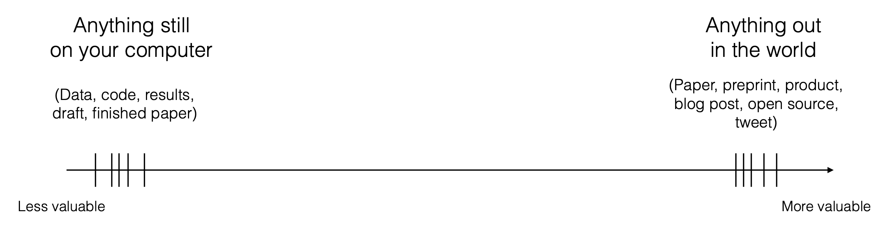

Líneas borradas

.center.float-left[.box-5.less-medium[Hiring]&ensp;.box-5.less-medium[Promotion]]

--

.center.float-left.sp-after[.box-5.less-medium[Networking]&ensp;.box-5.less-medium[Citations]]

--

.box-inv-5.large[Control the narrative about yourself!]

--

.box-inv-5.less-medium[Presunción de laboralidad]

.center.float-left.sp-after[.box-5.less-medium[No/slow feedback]&ensp;.box-5.less-medium[Luck]]

--

.box-inv-5.medium[Work in public and build a community]

---

layout: true
class: title title-3

---

---
# Search engine rankings

.box-inv-3.medium[Algorithms determine your rankings in search engines]

--

.box-3[Make profiles on standard websites to borrow those sites' reputations]

---

# Use other peoples' websites

--

.box-inv-3.medium[Google Scholar]

--

.box-inv-3.medium[ORCID]

--

.box-inv-3.medium[Institutional directory]

--

.box-inv-3.medium[LinkedIn]

---

# Link your profiles

&nbsp;

.box-inv-3.medium[List your different profiles on each site  to help the algorithm link them together]

---

layout: false
class: center middle section-title section-title-4 animated fadeIn

# Show people who you are

---

layout: true
class: title title-4

---

# Show people who you are

&nbsp;

--

.box-inv-4.medium.sp-after[Your own website]

--

.box-inv-4.medium[Social media]

---

# Use your own website

.box-inv-4.medium[Have a central place that is all about you and what you do]

--

.box-4[Control the narrative about you]

--

.box-4[Point everything else here]

---

# How and where?

.box-inv-4.medium[A website is .smaller[(typically)] a set of HTML files that lives on a computer somewhere in the world]

--

.box-4[Use someone else's server or your own]

---

# Site creation + hosting

.pull-left[
.box-inv-4[.medium[Google Sites] .light.small[(free; limited design choices)]]

.box-inv-4[.medium[Wix] .light.small[(free/paid; ad-supported)]]

.box-inv-4[.medium[Your institution] .light.small[(free; unknown process for editing)]]
]

.pull-right[
.box-inv-4[.medium[WordPress] .light.small[(free/paid; more design options)]]

.box-inv-4[.medium[Weebly] .light.small[(free/paid; ad-supported)]]

.box-inv-4[.medium[Squarespace] .light.small[(free/paid; ad-supported)]]
]

---

# More technical + more control

.pull-left[
.box-inv-4[.medium[Netlify] .light.small[(free; supply your own HTML)]]
]

.pull-right[
.box-inv-4[.medium[GitHub Pages] .light.small[(free; supply your own HTML)]]
]

.center[
.box-inv-4[.medium[Self-hosted] (like Digital Ocean) .light.small[(cheap; total control; more complicated!)]]
]

---

# Domain name

.box-inv-4.medium[A domain name is an address that points at a server]

.box-4.sp-after[sites.google.com/yourname vs. yourname.com]

--

.box-inv-4.sp-before[You can point a domain name at pretty much any hosting option]

.box-4[iwantmyname.com]

---

# What should be there?

.box-inv-4.medium[At minimum]

--

.float-left.center[.box-4[About]&ensp;.box-4[CV]]

.float-left.center[.box-4[Research]&ensp;.box-4[Teaching]]

--

.box-inv-4.medium.sp-before[Other stuff]

.float-left.center[.box-4[Blog]&ensp;.box-4[/uses & /now]]

---

# Social media

&nbsp;

.box-inv-4.medium[Have a presence on social media]

.box-4[Twitter, Instagram, TikTok, etc.]

---

# What should I post?

.pull-left[
.box-inv-4.medium[Strictly professional]

.box-4[Only advertise your research]
]

--

.pull-right[
.box-inv-4.medium[Personal + professional]

.box-4[Show the world who you are .smaller[(part of that is research)]]
]

---

# Why?

.box-inv-4.medium[Boost your own work]

.center[
<figure>
  
</figure>
]

???

<https://doi.org/10.1016/j.athoracsur.2020.04.065>

---

# Why?

.box-inv-4.medium[Build and participate in a community]

--

.box-4[\#acwri]

--

.box-4[\#rstats]

--

.box-4[\#EpiTwitter]

--

.center.float-left[.box-4[\#poliscicooks] .box-4[\#poliscibakes]]

---

layout: false
class: center middle section-title section-title-7 animated fadeIn

# Show people what you do

---

layout: true
class: title title-7

---

# Show people what you do

&nbsp;

--

.box-inv-7.medium.sp-after[Your in-progress work]

--

.box-inv-7.medium[Your finished work]

---

layout: false

.box-7.medium[How we normally think of our work and goals]

&nbsp;

.center[
<figure>
  
</figure>
]

???

<http://varianceexplained.org/r/start-blog/>

<https://rstudio.com/resources/rstudioconf-2019/the-unreasonable-effectiveness-of-public-work/>

---

.box-7.medium[How we *should* think of our work and goals]

&nbsp;

.center[
<figure>
  
</figure>
]

???

<http://varianceexplained.org/r/start-blog/>

<https://rstudio.com/resources/rstudioconf-2019/the-unreasonable-effectiveness-of-public-work/>

---

layout: true
class: title title-7

---

# Make your work available

--

.box-inv-7.medium[Most journals allow you to post preprints online]

.box-7.sp-after[(pre-typeset and pre-edited versions)]

--

.box-inv-7.medium[Consider posting working papers too!]

---

# Where?

--

.box-inv-7.medium[~~Academia.edu & ResearchGate~~]

--

.box-inv-7.medium.sp-after[Make it as easy as possible to access your stuff!]

--

.center.float-left[.box-7[Your own website]&ensp;.box-7[Institutional repository]]

.center.float-left[.box-7[SocArXiv]&ensp;.box-7[Dropbox]&ensp;.box-7[Google Drive]]

---

# Radical transparency and public work

--

.box-inv-7.medium[Go beyond just posting your research!]

--

.box-inv-7[Work in public]

.center[
<figure>
  
</figure>
]

---

# (Easy-ish) ways to work in public

--

.box-inv-7.less-medium[Play with (and blog about) data]

.center.sp-after[
.small[[Example](https://www.andrewheiss.com/blog/2017/08/26/quickly-play-with-polity-iv-and-oecd-data-and-see-the-danger-of-us-democracy/)]&emsp;.small[[Example](https://www.andrewheiss.com/blog/2018/12/28/tidytext-pos-arabic/)]
]

--

.box-inv-7.less-medium[Play with (and blog about) methods]

.center.sp-after[
.small[[Example](https://www.andrewheiss.com/blog/2020/12/01/ipw-binary-continuous/)]&emsp;.small[[Example](https://www.andrewheiss.com/blog/2021/08/21/r2-euler/)]&emsp;.small[[Example](https://www.andrewheiss.com/blog/2021/01/15/msm-gee-multilevel/)]
]

--

.box-inv-7.less-medium[Teach concepts (to yourself, mostly!)]

.center.sp-after[
.small[[Example](https://www.andrewheiss.com/blog/2019/01/29/diff-means-half-dozen-ways/)]&emsp;.small[[Example](https://www.andrewheiss.com/blog/2021/12/01/multilevel-models-panel-data-guide/)]&emsp;.small[[Example](https://www.andrewheiss.com/blog/2021/09/07/do-calculus-backdoors/)]
]

---

# Consequences of working in public

--

.box-inv-7.medium[Get quick feedback .small[(and corrections)] from smarter people]

--

.box-inv-7.medium[Find coauthors and publishing opportunities]

--

.box-inv-7.medium[Create a reference for yourself]

--

.box-inv-7.medium[Build your reputation as an expert]

---

layout: false
class: title title-6

# Control your internet presence!

--

.box-3.medium[Tell people you exist]

.box-inv-3.small.sp-after[List yourself on existing websites]

--

.box-4.medium[Show people who you are]

.box-inv-4.small.sp-after[Make your own website and use social media]

--

.box-7.medium[Show people what you do]

.box-inv-7.small[Show your in-progress and finished work]
